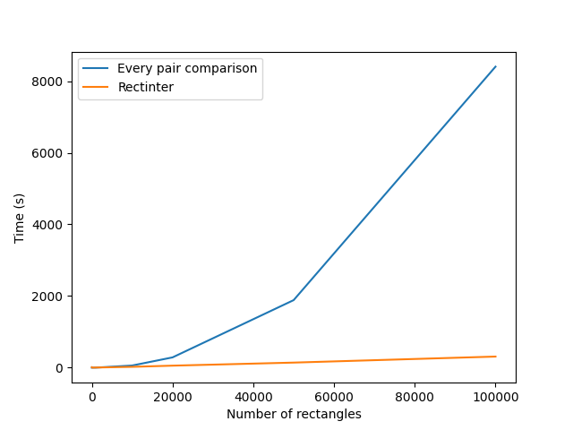

# **Contents of This Repository**

This repository contains the **rectinter** tool to solve the problems of one- and two-set rectangles intersection, originally presented in *"An Optimal Worst Case Algorithm for Reporting Intersections of Rectangles"* by **J. L. Bentley and D. Wood**.

For a list of rectilinear rectangles represented by the coordinates of their lower-left and upper-right corners, it returns a list of rectangles that intersect each rectangle in the list.

---

# **Installation**

To use the software provided in this repository, you will need a working Python3 distribution installed on your computer.

### **Clone the Repository**
The simplest way to install **rectinter** is to use the `git` command-line tool. Run the following command:

```bash
git clone https://github.com/sg406651/rectinter.git


